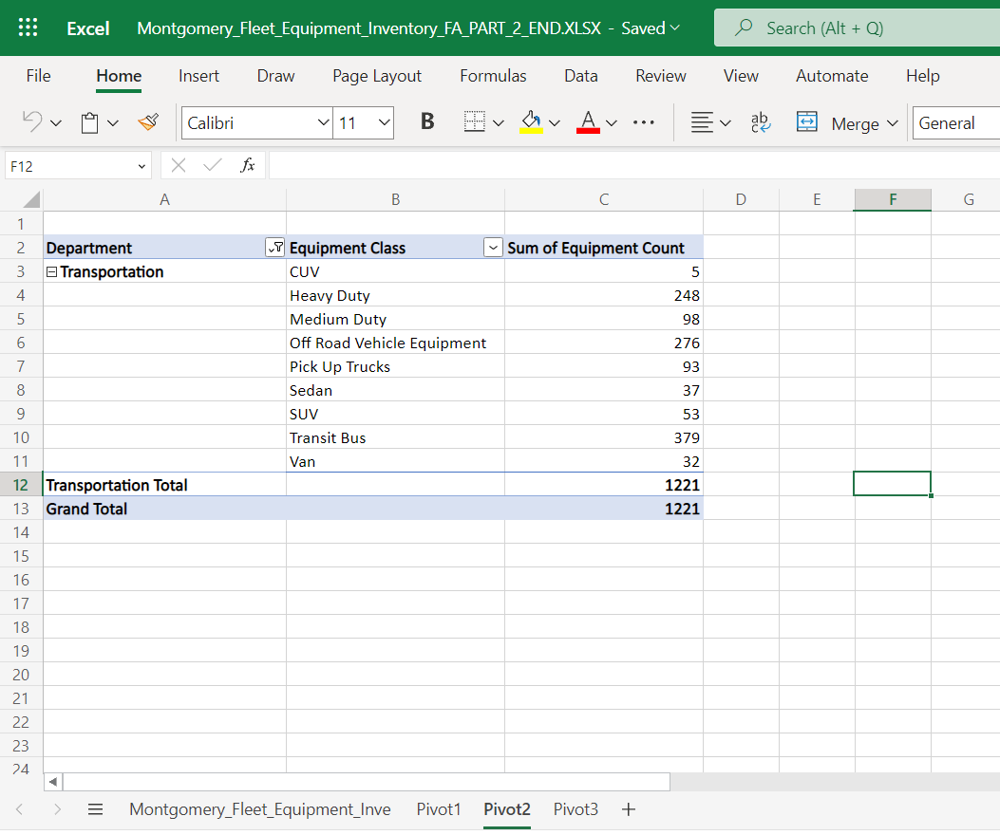

# Excel Basics for Data Analysis

This is the second course of [IBM Data Analysis Specialization](https://www.coursera.org/account/accomplishments/professional-cert/947G6HG93HX8). It includes the following modules.

### Agenda

1. Introduction to Data Analysis Using Spreadsheets
2. Getting Started with Using Excel Speadsheets
3. Cleaning & Wrangling Data Using Spreadsheets
4. Analyzing Data Using Spreadsheets
5. Final Project

## Labs

Althougth I did several labs in this course, I will only post the labs from the Final Project,  
as the changes are more visible. And in this case, It was posted the data and the final result.

### Final Project
#### 1. Part 1: Clean and Prepare the Data
  
* [Raw Data](https://innovaccion-my.sharepoint.com/:x:/g/personal/ceinnova12182_innovaccion_mx/EQnv7jkWRKhBtHKdsJM1OnIBpsyh8Zlkrz3Vaarpybo_nQ?e=qPqtpc)
    

    
* [Exercise Completed](https://innovaccion-my.sharepoint.com/:x:/g/personal/ceinnova12182_innovaccion_mx/ETx8YMY9DGFOpgrBpskwSRUBLC__6stHRD5BlLgZB_rwzg?e=FLaNhB)
  

  
#### 2. Part 2: Analyze the Data
  
* [Raw Data](https://innovaccion-my.sharepoint.com/:x:/g/personal/ceinnova12182_innovaccion_mx/EY2yGoZy-ZtKm1OYbYcdBvQBrnaNALU1i0V1i0JNy_4q9Q?e=eO0WwP)

* [Exercise Completed](https://innovaccion-my.sharepoint.com/:x:/g/personal/ceinnova12182_innovaccion_mx/EYIhYuG1cW1JmT4nGjXwDPoBTYYdvDCcmwWtsE9i91TiVQ?e=eCDfPA)

 
 
 
 

