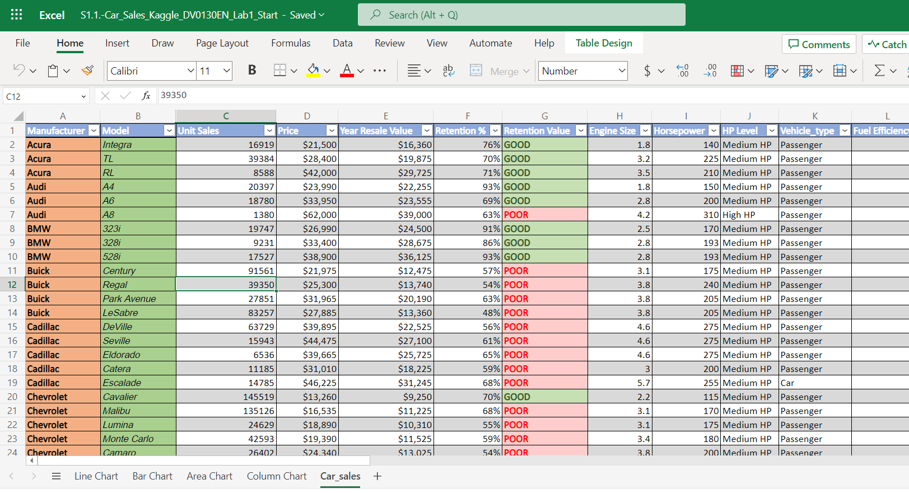
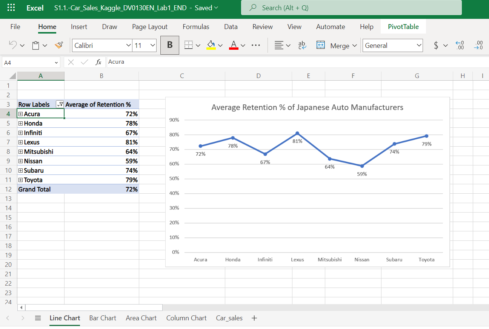
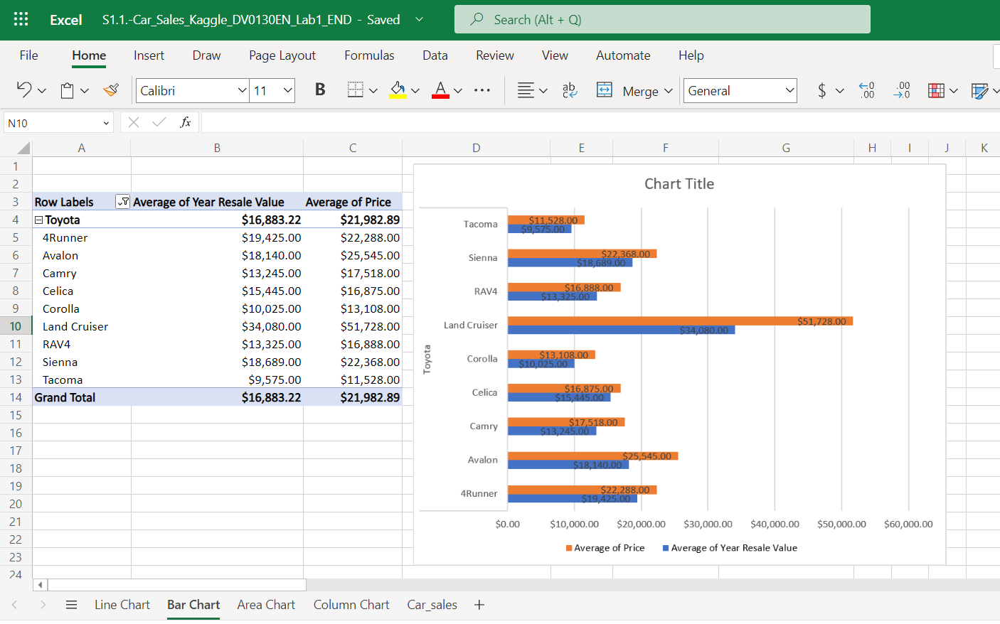
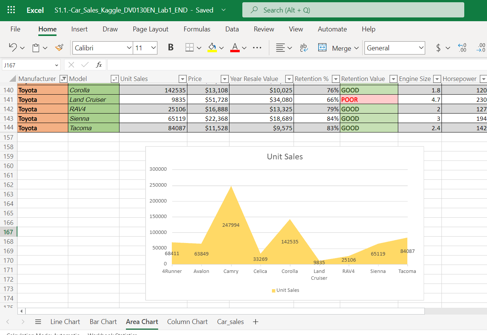

# Data Visualization and Dashboards with Excel and Cognos

This is the third course of [IBM Data Analysis Specialization](https://www.coursera.org/account/accomplishments/professional-cert/947G6HG93HX8). Fortunately, the content of the tasks is more visibles. 

### Agenda

1. Visualizing Data Using Spreadsheets
2. Creating Visualizations and Dashboards with Spreadsheets
3. Creating Visualizations and Dashboards with Cognos Analytics
4. Final Project

## Labs

The labs I have post are from modules 1, 2 and 4. This is because the use of Cognos Analytics was limited to the free trial.

### 1. Visualizing Data Using Spreadsheets

#### Creating Basic Charts

+ [Original Document](https://innovaccion-my.sharepoint.com/:x:/g/personal/ceinnova12182_innovaccion_mx/EYDXvTVuVoZGs-dRs2qxn9ABu44ZMmoWdHD_ntO2CBsq7Q?e=2zzsol)

+ [Task Completed](https://innovaccion-my.sharepoint.com/:x:/g/personal/ceinnova12182_innovaccion_mx/ERp0URiEmglFg2tbqO359ywBs5YXQIiD4bTxapiSMDyKrQ?e=fwjlh5)

 
 
 

### 2. Creating Visualizations and Dashboards with Spreadsheets

#### Creating Advanced Charts

