# Data Visualization and Dashboards with Excel and Cognos

This is the third course of [IBM Data Analysis Specialization](https://www.coursera.org/account/accomplishments/professional-cert/947G6HG93HX8). Fortunately, the content of the tasks is more visibles. 

### Agenda

1. Visualizing Data Using Spreadsheets
2. Creating Visualizations and Dashboards with Spreadsheets
3. Creating Visualizations and Dashboards with Cognos Analytics
4. Final Project

## Labs

The labs for modules 1, 2 and 4 are in original format , while those of Cognos Analytics were published in PDF document (Except module 3).
This is because the use of Cognos Analytics was limited to the free trial.

### 1. Visualizing Data Using Spreadsheets

#### Creating Basic Charts

+ [Original Document](https://innovaccion-my.sharepoint.com/:x:/g/personal/ceinnova12182_innovaccion_mx/EYDXvTVuVoZGs-dRs2qxn9ABu44ZMmoWdHD_ntO2CBsq7Q?e=2zzsol)

+ [Lab Completed](https://innovaccion-my.sharepoint.com/:x:/g/personal/ceinnova12182_innovaccion_mx/ERp0URiEmglFg2tbqO359ywBs5YXQIiD4bTxapiSMDyKrQ?e=fwjlh5)

 
 
 

### 2. Creating Visualizations and Dashboards with Spreadsheets

#### 1. Creating Advanced Charts

+ [Original Document](https://innovaccion-my.sharepoint.com/:x:/g/personal/ceinnova12182_innovaccion_mx/ESxfpRHonaxAsfdltIFfc7gBUO0pvh3ZvaSisLbm447ApA?e=OXMPlh)

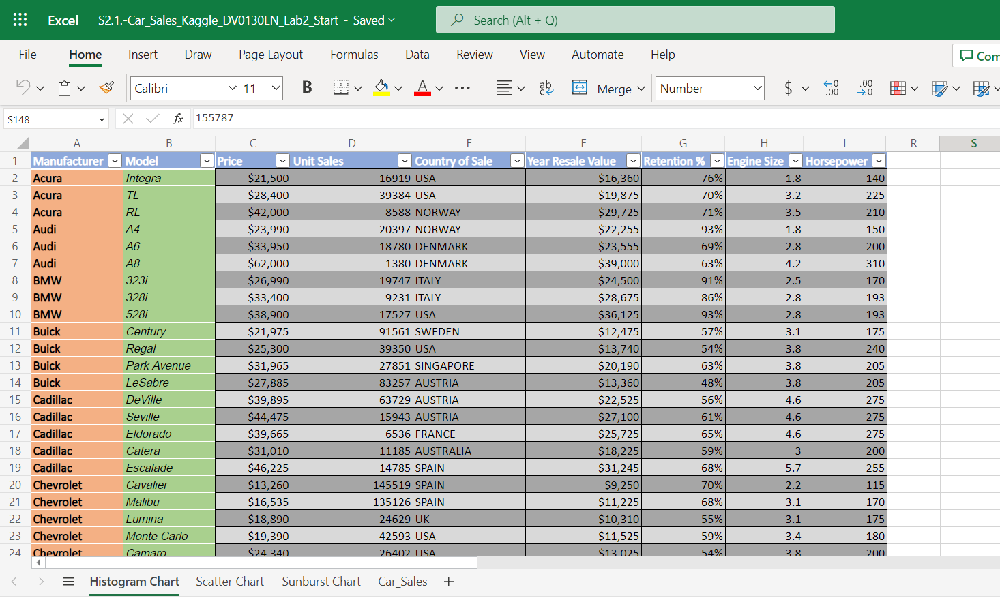

+ [Lab Completed](https://innovaccion-my.sharepoint.com/:x:/g/personal/ceinnova12182_innovaccion_mx/EXxY8JbmkiBKhaqdWG-c_mwB72JjLQLNRbi1zZrZsDvFpg?e=MZGafn)

 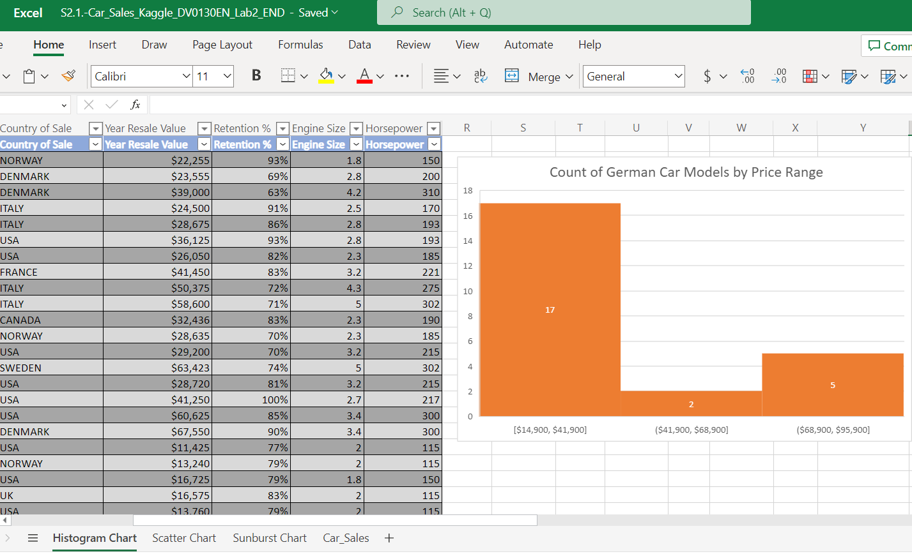
 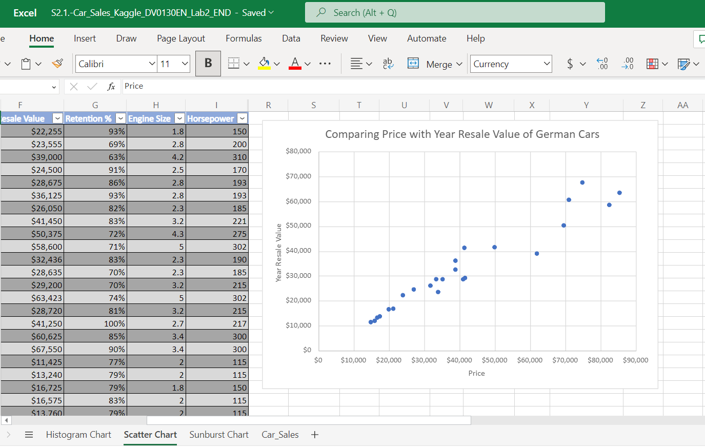
 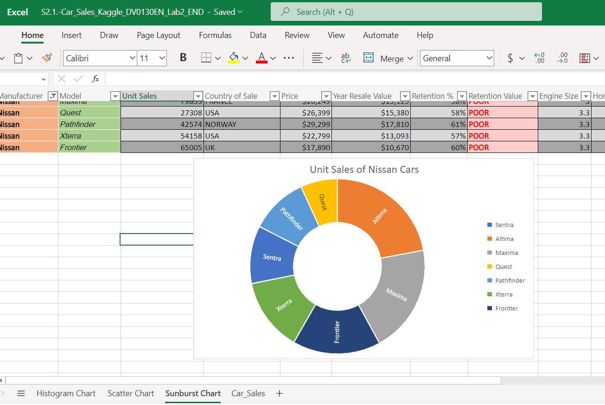

#### 2. Creating a Simple Dashboard with Excel

+ [Original Document](https://innovaccion-my.sharepoint.com/:x:/g/personal/ceinnova12182_innovaccion_mx/EXqMh3f1VExEj3OnJ5iIFWYBcFDej8g0r0ge-n4WxA1plQ?e=UYwBsi)

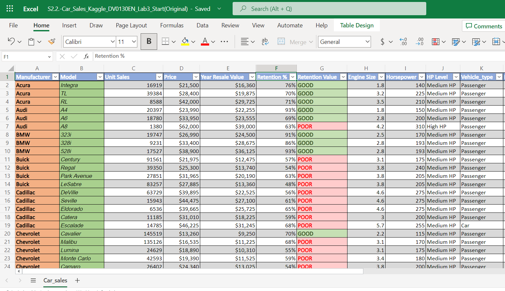

+ [Lab Completed](https://innovaccion-my.sharepoint.com/:x:/g/personal/ceinnova12182_innovaccion_mx/ETMsXwEZPtBHtxtzNHSvJXIBUt0WMKoRWdLl0R_cYQJtAA?e=zLwaUV)

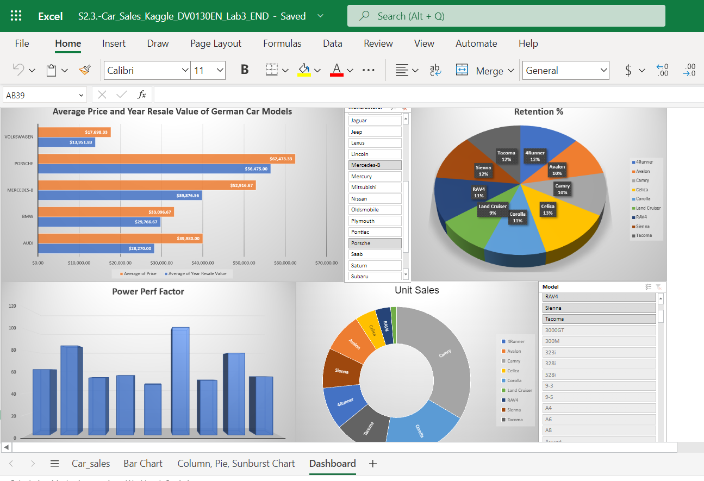
 

### 4. Final Project

#### 1. Part 1: Creating Visualizations Using Excel

+ [Original Document](https://innovaccion-my.sharepoint.com/:x:/g/personal/ceinnova12182_innovaccion_mx/EdPYbQVTqrNPlEFMq3ptMHUBYnJJqt11x68J2aEwhOXolg?e=IPqkGv)

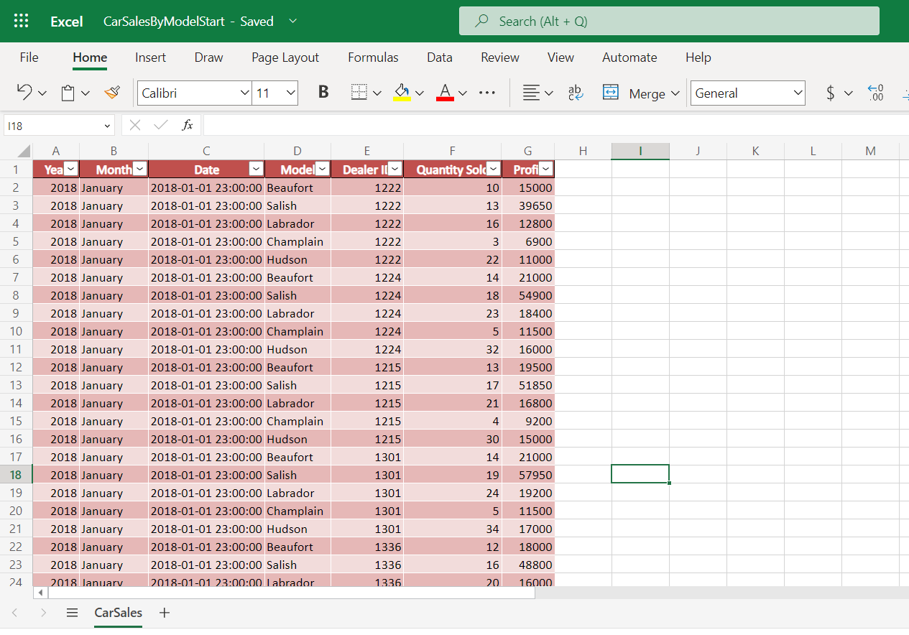

+ [Lab Completed](https://innovaccion-my.sharepoint.com/:x:/g/personal/ceinnova12182_innovaccion_mx/EZJS5D0LLy5NhBmgUDkPHU8Blc4_jayuWVy5DEJze3bQnA?e=Da89OO)

 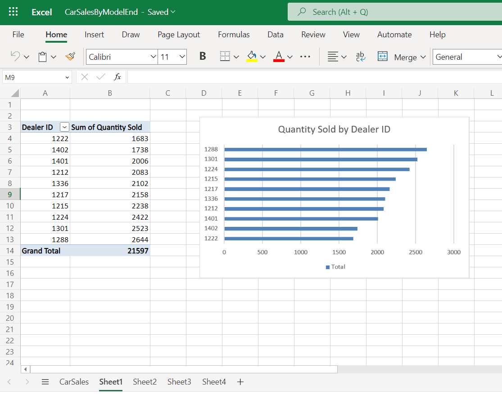
 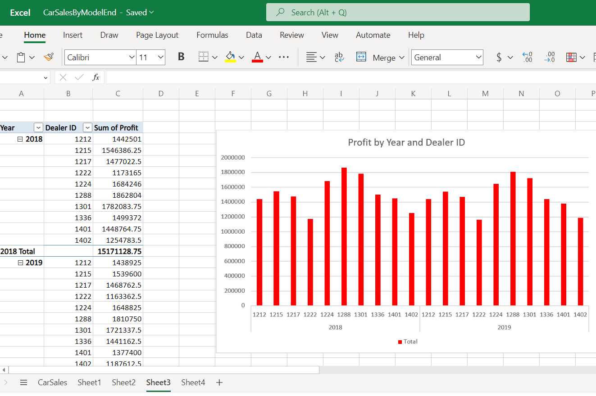
 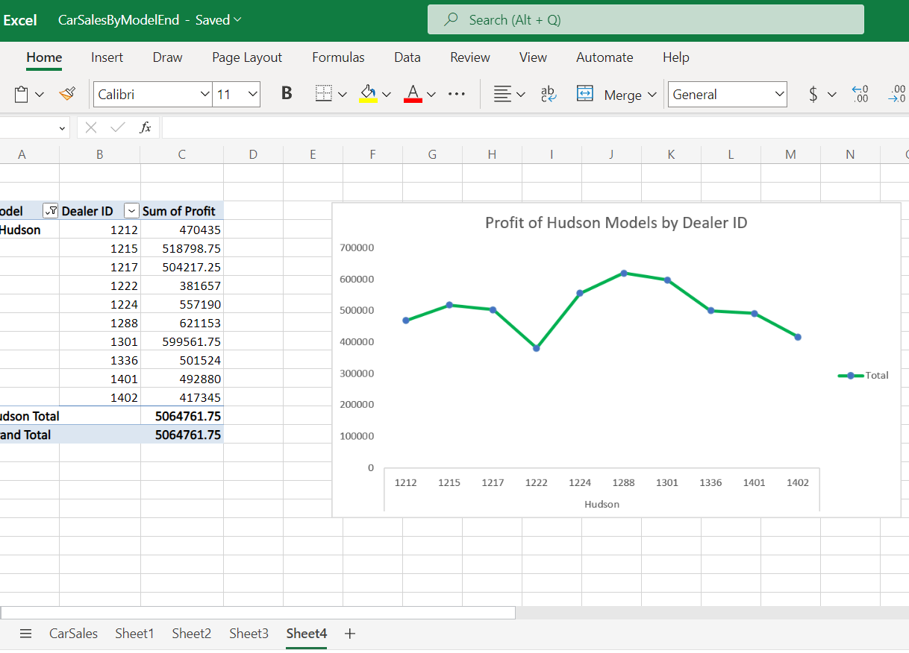

#### 2. Part 2: Creating Visualizations Using Cognos Analytics

+ [Lab Completed](https://innovaccion-my.sharepoint.com/:b:/g/personal/ceinnova12182_innovaccion_mx/EVrWExnIcVNHoxzRQnHJ-lsB98TkOuA_QVYsyOjq0sIfxQ?e=WgpU69)

 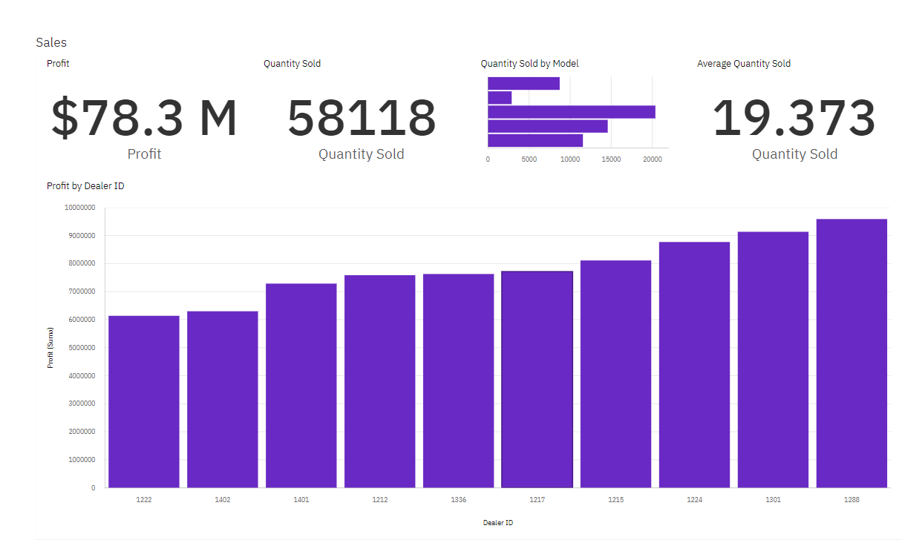
 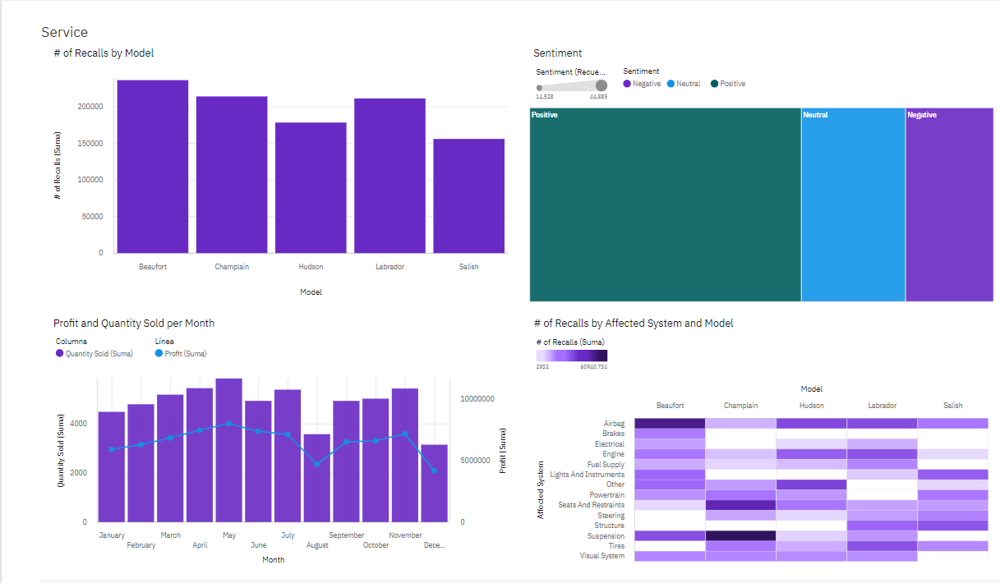

